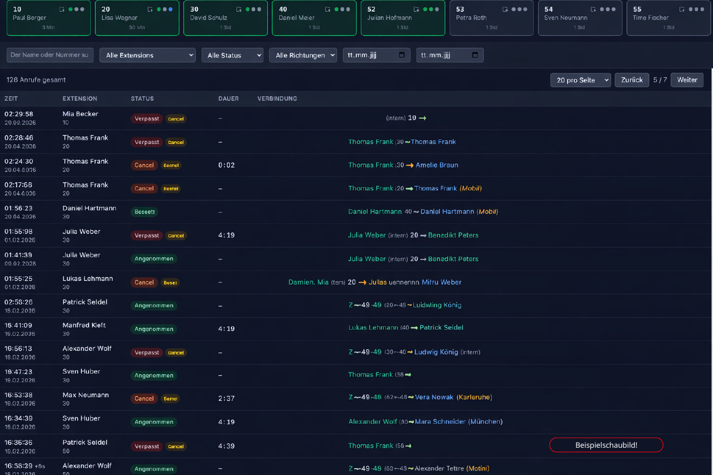

# NFON Call Monitor

> Real-time call monitoring dashboard for NFON phone systems — live calls, extension status & call history with optional CRM contact lookup.

Echtzeit-Anrufüberwachung für NFON-Telefonanlagen. Zeigt eingehende/ausgehende Anrufe als Live-Dashboard mit persistenter Historie und optionaler ProjectFacts-CRM-Integration.



---

## Features

### Live-Monitoring

- **Echtzeit-Dashboard** — Alle eingehenden und ausgehenden Anrufe erscheinen sofort via WebSocket, ohne Seite neu zu laden. Status-Updates (klingelt, aktiv, angenommen, verpasst) werden live gepusht.
- **Extension-Karten** — Jede Nebenstelle als Karte mit Live-Presence (online/offline), aktuellem Anruf-Status, Gesprächspartner, Gesprächsdauer und Idle-Zeit seit letzter Aktivität.
- **Agent-Queue-Status** — Dritter Status-Punkt (blau) auf Extension-Karten zeigt an, ob ein Agent in der Warteschlange eingeloggt ist (`*87`/`**87`). Status wird in SQLite persistiert.
- **Benutzer-Status (Präsenz)** — Jeder Benutzer kann seinen Status setzen (Online, Office, Homeoffice, Mittagspause, Offline) mit optionaler Freitext-Nachricht. Farbige Badges auf den Extension-Karten, Echtzeit-Broadcast an alle Clients.
- **Verbindungs-Indikator** — Zeigt jederzeit an, ob die SSE-Verbindung zur NFON API steht oder unterbrochen ist.
- **Auto-Update-Banner** — Informiert Benutzer mit offener Session wenn eine neue Version deployed wurde. Frontend pollt `/api/version` und zeigt ein blaues Banner mit "Jetzt aktualisieren"-Button.

### Anrufsteuerung

- **Click-to-Dial** — Anrufe direkt aus dem Dashboard starten. Rufnummer per Drag & Drop auf eine Extension-Karte ziehen oder den Zwischenablage-Button nutzen. Bestätigungsdialog direkt auf der Karte mit Erfolgs-/Fehler-Feedback.

### Anrufhistorie

- **Persistente Call-Historie** — NFON bietet keinen History-Endpoint. Das Backend bleibt 24/7 am SSE-Stream und speichert jeden Anruf in SQLite. Beim Öffnen des Dashboards ist die komplette Historie sofort verfügbar.
- **Umfangreiche Filter** — Nach Extension, Status (angenommen/verpasst/besetzt/abgelehnt), Richtung (ein-/ausgehend) und Zeitraum filtern. Alle Filter kombinierbar.
- **"Echt verpasst"-Filter** — Berücksichtigt Gruppenrufe: Bei Sammelruf gilt ein Anruf nur als verpasst wenn KEINE Nebenstelle angenommen hat.
- **Volltextsuche** — Suche nach Telefonnummer, Extension-Name oder (bei aktiver ProjectFacts-Integration) Kontaktname. Ein Suchfeld, alle Treffer.
- **Pagination** — Konfigurierbare Seitengröße (5 bis 100 Einträge), server-seitig paginiert für schnelle Ladezeiten auch bei tausenden Anrufen.
- **Copy to Clipboard** — Jede Telefonnummer hat ein dezentes Copy-Icon (erscheint bei Hover), ein Klick kopiert die formatierte Nummer mit grünem Häkchen als Bestätigung.
- **Relative Zeitanzeige** — "Heute" / "Gestern" statt numerischem Datum in der Zeit-Spalte.
- **Server-Downtime-Erkennung** — Bei Neustart erkennt der Server wie lange er offline war und erstellt einen System-Eintrag in der Anrufliste mit Dauer der Lücke.

### Kontakterkennung

- **ProjectFacts CRM-Integration** — Optionale Anbindung an [ProjectFacts](https://www.projectfacts.de/). Kontaktnamen werden automatisch neben Telefonnummern angezeigt. Cache mit Auto-Refresh alle 15 Minuten.
- **Dreistufige Zuordnung** — Exakter Match (Name in Blau), Fuzzy Match für deutsche Festnetznummern mit bis zu 3 abweichenden Endziffern (Name + `?`-Indikator), Fallback auf Ortsname.
- **5.200+ deutsche Vorwahlen** — Automatische Ortserkennung aus der Bundesnetzagentur-Datenbank. Festnetznummern zeigen den Stadtnamen (z.B. *Bensheim*, *Frankfurt am Main*), Mobilnummern werden als *Mobil* gekennzeichnet.
- **Intelligente Formatierung** — Rohe Nummern wie `49625182755` werden als `+49 6251 82755` dargestellt, mit korrekter Vorwahl-Trennung.
- **Standort-Anzeige** — Interne Nummern zeigen den Standortnamen, z.B. `ZBens-20` statt nur `20`.

### Benachrichtigungen

- **Browser-Push-Notifications** — Desktop-Benachrichtigungen für eingehende und verpasste Anrufe. Glocken-Icon im Header zum Ein-/Ausschalten. Einstellung wird in localStorage gespeichert.
- **"Meine Extension"-Auswahl** — Benutzer kann seine eigene Nebenstelle im Header setzen. Notifications werden nur für die eigene Extension angezeigt.

### Betrieb & Sicherheit

- **Dashboard-Login** — JWT-basierte Authentifizierung mit SHA-256-gehashten Passwörtern. Kein ungeschützter Zugriff auf Anrufdaten.
- **Docker-ready** — Multi-Stage Build (3 Stufen) auf Alpine-Basis, Multi-Platform (amd64/arm64). Produktionsimage ohne Dev-Dependencies.
- **Health-Check-Endpoint** — `GET /api/health` (ohne Auth) liefert Server-Status für Monitoring-Tools (Uptime Kuma, etc.). `200 ok` wenn NFON SSE verbunden, `503 degraded` wenn nicht.
- **Prometheus-Metriken** — `GET /api/metrics` mit Basic Auth für Grafana-Integration. Metriken: `nfon_up`, `nfon_uptime_seconds`, `nfon_websocket_clients`, `nfon_active_calls`, `nfon_calls_total{status=...}`, etc.
- **Tägliches DB-Backup** — Automatisches SQLite-Backup täglich um 02:00 Uhr. Alte Backups werden nach konfigurierbarer Anzahl Tage bereinigt (`BACKUP_KEEP_DAYS`).
- **Daten-Retention** — Anrufe älter als X Tage werden täglich automatisch gelöscht (`RETENTION_DAYS`, Standard: 60).
- **Dark Mode** — Komplettes Dark/Light-Theme, automatisch oder manuell umschaltbar.
- **Structured Logging** — Log-Levels mit Timestamps (`info`/`warn`/`error`/`debug`). Standard: nur Startup, Fehler und Warnungen. Verbose via `LOG=debug`.
- **Auto-Reconnect** — SSE-Verbindung zur NFON API wird bei Abbruch automatisch wiederhergestellt. Verpasste Events während der Unterbrechung werden als `stale` markiert.
- **Adaptive Presence-Polling** — Polling-Rate passt sich automatisch der Aktivität an (3s bei aktiven Calls bis 60s im Idle).

---

## Architektur

```
NFON CTI API (SSE Stream)         ProjectFacts API
        │                                │
        ▼                                ▼
┌──────────────────────────────────────────────┐
│  Backend (Express)                           │
│  ├─ NFON SSE → CallAggregator → SQLite       │
│  ├─ PF-Cache (15 Min. Refresh)               │
│  ├─ Phone-Utils (Normalisierung, Vorwahlen)  │
│  └─ REST API + Socket.IO                     │
└──────────────────┬───────────────────────────┘
                   │ WebSocket + REST
                   ▼
┌──────────────────────────────────────────────┐
│  Frontend (React 19 + Vite + Tailwind v4)    │
│  ├─ Extension-Cards mit Presence             │
│  ├─ Call-Historie mit Filtern                │
│  ├─ Active-Call-Banner                       │
│  └─ CRM-Kontaktanzeige (Name, Ort, Fuzzy)    │
└──────────────────────────────────────────────┘
```

### Warum ein Backend?

Das Frontend kann **nicht** direkt mit der NFON API kommunizieren:

1. **Credentials** — Login + Token-Refresh brauchen Username/Password. Die dürfen nicht im Browser liegen.
2. **CORS** — Die NFON API erlaubt keine Browser-Requests (keine CORS-Header).
3. **Persistenz** — NFON hat keinen Call-History-Endpoint. Die einzige Datenquelle ist der Live-SSE-Stream. Das Backend bleibt 24/7 verbunden, aggregiert Events zu Call-Records und speichert sie in SQLite. Beim Öffnen des Frontends ist die Historie sofort da.

### Datenfluss

1. **nfon-connector.ts** — Hält die SSE-Verbindung zu NFON offen, reconnected automatisch bei Abbruch
2. **call-aggregator.ts** — Korreliert rohe SSE-Events (start/ring/answer/hangup/end) per UUID zu CallRecords
3. **db.ts** — Persistiert CallRecords in SQLite (Node.js built-in `node:sqlite`)
4. **projectfacts.ts** — Lädt Kontakte aus ProjectFacts, cached im Speicher, Refresh alle 15 Min.
5. **phone-utils.ts** — Normalisiert Rufnummern, erkennt Vorwahlen, formatiert Anzeige
6. **server.ts** — Express-Server leitet Events per Socket.IO an alle Browser-Clients weiter
7. **Frontend** — React-App holt Historie per REST, empfängt Live-Updates per Socket.IO

---

## Setup

```bash
# .env anlegen (Zugangsdaten von NFON)
cp .env.example .env

# Backend-Dependencies
npm install

# Frontend-Dependencies
cd frontend && npm install && cd ..
```

### .env

```bash
# === NFON CTI API (erforderlich) ===
CTI_API_USERNAME=...
CTI_API_PASSWORD=...
# CTI_API_BASE_URL=https://providersupportdata.cloud-cfg.com

# === Kopfnummern / Trunk-Prefixes (optional) ===
# KOPFNUMMERN=4930555789,49030555123
# KOPFNUMMERN_NAME=Berlin,Berlin2

# === Dashboard Auth ===
DASHBOARD_USER=admin
DASHBOARD_PASSWORD_HASH=   # sha256: echo -n 'password' | shasum -a 256
# DASHBOARD_JWT_SECRET=    # stabil über Restarts

# === App ===
# APP_TITLE=NFON Call Monitor
# LOG=debug                   # Verbose logging (Click-to-Dial, SSE, Presence)

# === ProjectFacts CRM (optional) ===
# PF_API_BASE_URL=https://team.stylite.de
# PF_API_DEVICE_ID=
# PF_API_TOKEN=

# === Sondernummern & Agent-Queue (optional) ===
# SPECIAL_NUMBERS=*87:Agent On,**87:Agent Off,*55:Primärgerät,...
# AGENT_ON_CODE=*87
# AGENT_OFF_CODE=**87

# === Monitoring (optional) ===
# METRICS_USER=prometheus      # Prometheus-Endpoint aktivieren
# METRICS_PASS=secret

# === Datenbank (optional) ===
# RETENTION_DAYS=60            # Anrufe älter als X Tage löschen
# BACKUP_KEEP_DAYS=7           # Backups älter als X Tage löschen

# === Phone-Klassifizierung (optional, sensible Defaults) ===
# MOBILE_PREFIXES=150,151,152,...
# SPECIAL_PREFIXES=800,1801,1802,...
```

---

## Starten

```bash
# Beide zusammen (Backend + Frontend)
npm run dev

# Oder einzeln:
npm run dev:backend    # Express auf :3001
npm run dev:frontend   # Vite auf :5173

# CLI Monitor (ohne Frontend, nur Terminal-Output)
npm run monitor
```

### Docker

```bash
docker build -f docker/Dockerfile -t nfon-monitor --build-arg VERSION=1.0.0 .
docker run -p 3001:3001 --env-file .env nfon-monitor
```

---

## ProjectFacts CRM-Integration

Die ProjectFacts-Integration ist **optional** — ohne Konfiguration funktioniert alles, nur ohne Kontaktnamen.

### Funktionsweise

1. **Cache-Aufbau** — Beim Start lädt das Backend alle Kontakte mit Telefonnummern aus ProjectFacts (paginiert, max. 10 parallele Requests)
2. **Auto-Refresh** — Der Cache wird alle 15 Minuten automatisch aktualisiert
3. **Dreistufige Zuordnung** bei eingehenden/ausgehenden Anrufen:

| Stufe | Methode | Beispiel |
|-------|---------|---------|
| 1 | **Exakte Suche** — Nummer exakt im Cache | `+49 6251 82755` → "Mustermann GmbH" |
| 2 | **Fuzzy Match** — Endziffern entfernen (nur Festnetz, max. 3 Stellen) | `+49 6251 82755-23` → "Mustermann GmbH?" |
| 3 | **Fallback** — Ortsnetz/Typ-Label aus Vorwahl-DB | `+49 6251 ...` → *Heppenheim* |

### Anzeige im Frontend

- **Exakter Match** — Kontaktname in Blau
- **Fuzzy Match** — Kontaktname + `?` bis `???` (je nach entfernten Ziffern)
- **Nur Ort** — Stadtname in Amber/Kursiv
- **Unbekannt** — Formatierte Rufnummer

---

## Tech-Stack

| Komponente | Technologie |
|---|---|
| Backend | Express, Socket.IO, Node.js built-in SQLite |
| Frontend | React 19, Vite, Tailwind CSS v4 |
| Echtzeit | Socket.IO (WebSocket) |
| Datenbank | SQLite (WAL-Modus, Datei `calls.db`) |
| NFON-Anbindung | SSE (Server-Sent Events) |
| CRM | ProjectFacts REST API (optional) |
| Auth | JWT (Dashboard-Login) |
| Deployment | Docker (Multi-Stage Build, Node 22 Alpine) |

---

## Dateistruktur

```
├── docker/Dockerfile             # Multi-Stage Production Build
├── shared/types.ts               # Gemeinsame TypeScript-Interfaces
├── src/
│   ├── auth.ts                   # NFON Login + Token-Refresh
│   ├── api.ts                    # NFON API-Aufrufe
│   ├── server.ts                 # Express + Socket.IO
│   ├── db.ts                     # SQLite Schema + CRUD
│   ├── call-aggregator.ts        # SSE-Events → CallRecords
│   ├── nfon-connector.ts         # SSE-Verbindung + Reconnect
│   ├── projectfacts.ts           # PF-Cache, Kontakt-Lookup
│   ├── phone-utils.ts            # Normalisierung, Vorwahlen, Formatierung
│   ├── dashboard-auth.ts         # JWT Auth Middleware
│   ├── monitor.ts                # Standalone CLI-Monitor
│   └── routes/
│       ├── calls.ts              # GET /api/calls
│       ├── extensions.ts         # GET /api/extensions
│       ├── auth.ts               # POST /api/auth/login
│       ├── pf.ts                 # GET/POST /api/pf/lookup
│       └── click-to-dial.ts     # POST/DELETE /api/click-to-dial
└── frontend/
    └── src/
        ├── App.tsx
        ├── hooks/                # useSocket, useCalls, useExtensions, usePfContacts
        ├── components/           # Dashboard, CallHistoryTable, ExtensionCards, ...
        └── lib/                  # API-Client, Formatter
```

---

## API

### REST

| Endpoint | Beschreibung |
|---|---|
| `POST /api/auth/login` | Dashboard-Login (JWT) |
| `GET /api/version` | App-Version & Titel |
| `GET /api/health` | Health-Check (ohne Auth) — `200 ok` / `503 degraded` |
| `GET /api/metrics` | Prometheus-Metriken (Basic Auth via `METRICS_USER`/`METRICS_PASS`) |
| `GET /api/calls?page=1&pageSize=50&extension=20&status=missed&direction=inbound&dateFrom=...&dateTo=...` | Anrufhistorie (paginiert, gefiltert) |
| `GET /api/extensions` | Extension-Liste mit Presence |
| `POST /api/extensions/status` | Benutzer-Status setzen (`{ extension, status, message }`) |
| `GET /api/pf/lookup?number=...` | Einzelner Kontakt-Lookup |
| `POST /api/pf/lookup-batch` | Batch-Lookup (`{ numbers: [...] }`) |
| `POST /api/click-to-dial` | Click-to-Dial (`{ extension, target }`) → 202 |
| `DELETE /api/click-to-dial/:uuid` | Laufenden Anruf abbrechen → 204 |

### Socket.IO Events

| Event | Richtung | Beschreibung |
|---|---|---|
| `active-calls` | Server → Client | Aktive Calls bei Verbindung |
| `extensions` | Server → Client | Extension-Liste + Presence |
| `call:new` | Server → Client | Neuer Anruf erkannt |
| `call:updated` | Server → Client | Anruf-Status geändert |
| `nfon:connected` | Server → Client | SSE-Verbindung steht |
| `nfon:disconnected` | Server → Client | SSE-Verbindung unterbrochen |
| `user-status:changed` | Server → Client | Benutzer-Status geändert |

---

## NFON API Docs

- [CTI API](https://github.com/NFON-AG/CTI-API)
- [API Explorer](https://nfon-ag.github.io/Service-Portal-API-Specification/net/nfon/portal/api/Api.html)
- [Service Portal API](https://github.com/NFON-AG/Service-Portal-API)

### Bekannte Einschränkungen

- **Keine Call-History API** — Weder CTI noch Service Portal API bieten historische Anrufdaten. Der Live-SSE-Stream ist die einzige Quelle.
- **Keine Gruppenanrufe** — *"Functions such as group calls, skill-based calls or queues are currently not supported."*
- **Kein Gruppen-Feld** — Events enthalten nur eine einzelne Extension-Nummer.
- **Zentrale (Ext. 0)** — Vermutlich als Frontdesk-Service konfiguriert; deren Anrufe tauchen ggf. nicht im SSE-Stream auf.
